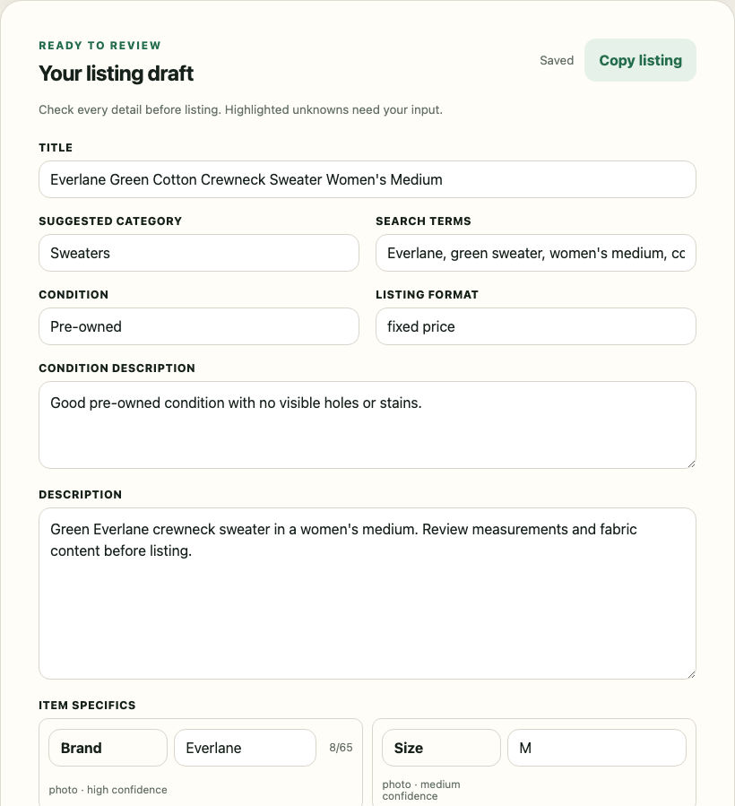

# eBay Listing Assistant

Turn item photos into an editable eBay listing draft. Review the details, add shipping
information, and publish from your phone or computer.

This tool is for small eBay resellers, especially clothing sellers. You install and
run your own copy. There is no shared public service or public signup. Once setup is
complete, daily use takes place in your browser.

Draft editor excerpt using invented test data. No real seller or listing data is shown.

## What you can do

1. Add 1–24 photos of one item and a short note about anything the photos cannot show.
2. Choose a category from the Men, Women, or Kids menus.
3. Select **Generate listing** to create a title, description, item specifics, and price estimate.
4. Check the draft, fill in missing facts, and save your work.
5. Copy the listing text, or complete the shipping fields and select **Publish live on eBay**.

You review every listing before publication. The app does not establish authenticity,
verify measurements, or guarantee the suggested price. Use Seller Hub to edit live
listings and manage orders, shipping, returns, messages, and payouts.

## Is it a fit?

| Supported now | Current limit |
| --- | --- |
| Clothing category menus | Men, Women, and Kids; check the available categories before use |
| eBay US listings | USD, fixed price, one item per listing, no variations |
| A small shared installation | At most two accounts, with one shared item postal code |
| Phone and computer browsers | Draft photos stay in the browser profile that saved them |
| Saved drafts and live publication | Live publication requires eBay setup and a controlled first-listing check |

Production publication and maximum-load acceptance checks remain incomplete. Treat the
current release as software that still needs those checks on your installation.

## Start here

- **Installing your own copy:** follow the [setup guide](docs/setup.md).
- **Using an existing installation:** follow the [reseller guide](docs/user-guide.md).
- **Need help?** See [support and troubleshooting](SUPPORT.md).

The person who sets up the app needs a GitHub account, DigitalOcean hosting, an OpenAI
API project with billing, and an eBay developer application. Each seller connects their
own eBay account. Sellers who use an existing installation do not need an OpenAI
account, API key, ChatGPT subscription, or developer tools.

The example hosting setup costs $12/month before API usage and other charges. An $8
OpenAI hard limit gives a $20 planning target, not a guaranteed bill. See the dated
[cost and storage notes](docs/setup.md#cost-and-storage) before you create resources.

## Your data

The server sends photos and notes to OpenAI to generate a draft. It removes temporary
photo files after each request. The database keeps account details, saved drafts,
encrypted eBay authorization, and records needed to recover publication.

Your browser also keeps original draft photos until you delete the draft or browser
storage removes them. Photos do not synchronize across devices. Keep your own originals;
browser storage is not a backup. eBay keeps photos you upload there under its own terms.

Deleting a published draft in this app does not end its live eBay listing.

## Development

For code changes, local setup, tests, and design records, see the
[developer guide](docs/development.md). Security problems must use the
[private reporting process](SECURITY.md).

Released under the [MIT License](LICENSE).

This project is independent of eBay. eBay is a trademark of its owner.
